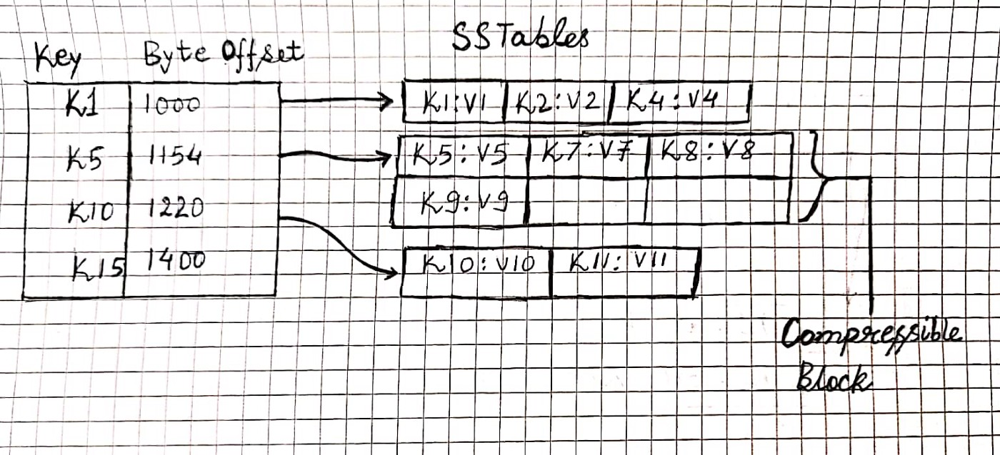
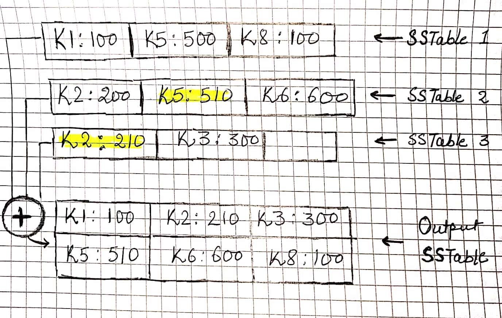

### What is a Log ?

Before jumping to know Log structured merge tree, let’s understand the log - in most general term, it is just the append-only sequence of records and hence immutable.

### Sorted String Table (SSTable)
Sorted String Table( SSTable ) is a log-structured disk-based storage engine widely used by many NoSQL distributed databases which store the data as key-value pair where the values are sorted by keys and that’s where the name comes from. SSTable is one disk-based implementation of LSM tree which was originally published at Google Big table paper.

SSTable stores the data as key-value pair on the disk in an append-only log file in sorted order. We will see below how exactly the data is maintained in the latter part.

### Accessing the data from SSTable

We can easily read any data by its bytes offset in a file, so same principle applies here. In a hash table, we can simply hold the byte offset of any key in a log file and through that, we can directly access the value of the key.

What if we run out of memory for holding many keys in memory, therefore (as shown in the above figure) the SSTable do not keep all the keys in memory but keep a memory structure sparse, that is memory index keeps only one key for few kilobytes of keys in the disk as it is quite efficient to read a few kilobytes of data sequentially. This will keep memory index sparse.

For example, when we have to access a key let’s say, k4 and the memory index has k1 and k50 and so on, but we know the records are sorted, so the key must be within k1 and k50 and it can jump to k1 and find k4 sequentially from there.

As the segment files are append-only, how will we cope up with the situation when the log file is going too big (as the records are only appended to the file) which can make the system run out of disk space. The solution is to break the log file into smaller segment files after it reaches certain maximum size (usually in MB) and perform the Compaction(merging them, we will revisit it in detail in later part) of those segment files.

As read requests need to scan over several key-value pairs in the requested range anyway, for example, read K2 through k4, it is possible to group those records into a block and compress it before writing it to disk. Each entry of the sparse in-memory index then points at the start of a compressed block. This optimization will also reduce the I/O bandwidth use.

What if the key does not even exist in the SSTable, the read request will go towards several segment file before it knows the key does not exist. In order to solve this problem, the database uses a probabilistic data structure called [Bloom filter](https://cassandra.apache.org/doc/latest/operating/bloom_filters.html) to early detect whether the key does not exist at all, or it may exist as it is not the deterministic structure.

### Compaction

As the record is append-only so when the "Write" operation comes for an existing (already appended) key. The update record also get appended to the segment file (SSTable) and now we have multiple version stored for the same key, but remember the last value added for the same key is the latest, or the most updated value.

Compaction is a process which merges the various segment files by taking the latest value for each key present (as shown in the above figure where k1 through k8 are the sorted keys). This process is run in background (in a separate thread) so that it does not affect much the real-time operations. This is also very efficient and fast as all the segment files are having sorted keys and while compaction is a simple merge sort like algorithm where you look at the first key in each file, copy the lowest key (according to the sort order) to the output file, and repeat.

Deletes are also handled in the same way, but they have a special marker called tombstone which hints the compaction process to delete all the values present in the SSTables.
Once the new SSTable has been written, the old SSTables can be removed or archived.

There is a very nice video for learning [Compaction and various strategies](https://university.scylladb.com/courses/scylla-operations/lessons/compaction-strategies/topic/compaction-strategies-2/) in detail.

### Concurrency Control

As the SSTable is append-only, concurrency can be achieved by having a single writer thread and having many concurrent readers without the need of any special latches(lightweight locks) because of its immutable property.

### SSTable as a Storage Engine

- To make "Write" efficient, and the data store the data in a sorted format, we can write the data into any self-balancing trees such as [AVL tree](https://en.wikipedia.org/wiki/AVL_tree) or [Red-black tree](https://en.wikipedia.org/wiki/Red%E2%80%93black_tree) which is a memory representation also known as `memtable`. When data on `memtable` reached to its maximum size as per configuration, it flushes the data to SSTable which is a disk-based implementation. While the flushing is taking place, the "Write" can still occur to `memtable`. Once the data is completely written to SSTable then `memtable` can be removed, archived or recycled. This approach is basically used by Cassandra DB.
- When data on `memtable` reached to its maximum size as per configuration, it flushes the data to SSTable which is a disk-based implementation. While the flushing is taking place, the write can still occur to memtable. Once the data is completely written to SSTable then memtable can be removed, archived or recycled. This approach is basically used by Cassandra DB.

### Crash Recovery

What if the system crashes, and `memtable` is not flushed to `SSTable`, in order to have a crash recovery, we can have a [Write ahead log (WAL)](https://en.wikipedia.org/wiki/Write-ahead_logging), which is just a plain append-only log structure. So, whenever a new write comes, it first gets appended to WAL, then it is written to memtable. so whenever the crash happens, WAL can be used to rebuild the memtable. Once the memtable is flushed, WAL can also be removed.

### Summary

LSM tree storage engine is widely adopted by Distributed databases such as [Level DB][Level DB], [Rock DB][Rock DB], [Apache Cassandra][Apache Cassandra], [Big Table][Big Table], [HBase][HBase] etc. LSM tree is very well performant for write operation because of its sequential writes on disk, but they perform very well for reads too.

[Level DB]: https://github.com/google/leveldb
[Rock DB]: https://rocksdb.org/
[Apache Cassandra]: https://cassandra.apache.org
[Big Table]: https://cloud.google.com/bigtable
[HBase]: https://hbase.apache.org/